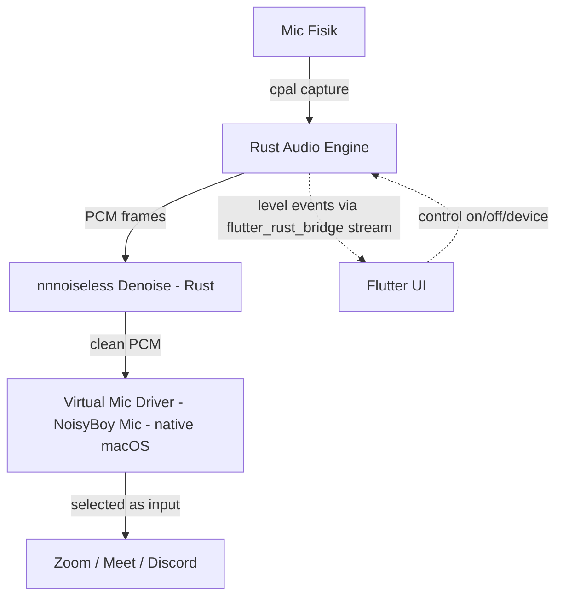

# PRD — NoisyBoy (Krisp-like Noise Suppression App)

## 1. Ringkasan Produk

NoisyBoy adalah aplikasi desktop (fokus awal: **macOS**) yang menghilangkan
suara berisik (background noise) dari microphone secara **real-time** menggunakan
AI, mirip [Krisp.ai](https://krisp.ai). Output audio bersih dialirkan ke aplikasi
konferensi (Zoom, Google Meet, Discord, dll) lewat sebuah **virtual microphone**.

### Tujuan
- Tangkap audio mic fisik → denoise dengan AI → keluarkan ke virtual mic.
- Latency rendah (target < 20ms end-to-end untuk terasa "live").
- UI toggle on/off, pilih input device, indikator level suara.

---

## 2. Cara Kerja Krisp (yang kita tiru)

```
[Mic Fisik] --> [NoisyBoy: capture] --> [AI Denoise] --> [Virtual Mic Output]
                                                              |
                                                              v
                                              [Zoom / Meet memilih "NoisyBoy Mic"]
```

Kunci: aplikasi konferensi **tidak** bicara langsung ke mic fisik. Mereka memilih
virtual mic kita sebagai input. Inilah bagian tersulit & paling penting.

---

## 3. Tech Stack

### 3.1 UI Layer — Flutter
- **Framework**: Flutter Desktop (macOS).
- **State management**: `flutter_bloc` (BLoC pattern, cocok untuk stream audio state).
- **Tanggung jawab**: kontrol UI, toggle noise suppression, pilih device,
  visualisasi level audio (waveform / VU meter), pengaturan.
- **Catatan**: Flutter TIDAK memproses audio. Flutter hanya UI + kontrol.
  Semua audio berjalan di native layer demi latency rendah.

### 3.2 Core Engine — Rust
- **Bahasa**: **Rust** (cross-platform, memory-safe, no GC pause → cocok audio real-time).
- **Audio I/O**: [`cpal`](https://github.com/RustAudio/cpal) — capture mic & output,
  cross-platform (macOS/Windows/Linux). Tak perlu nulis Swift/CoreAudio manual.
- **Threading**: audio callback jalan di thread real-time Rust. DSP + denoise
  di dalam callback → latency minimal, no glitch.
- **Jembatan Flutter <-> Rust**: [`flutter_rust_bridge`](https://github.com/fzyzcjy/flutter_rust_bridge)
  — auto-generate binding type-safe, support async & **stream** (untuk kirim event
  level audio ke UI).
  - Kontrol (on/off, pilih device) via panggilan fungsi Rust.
  - Event level audio via Rust `Stream` → Dart `Stream`.
  - Pemrosesan audio real-time TIDAK melewati Flutter — murni di Rust.

> [!NOTE]
> Keuntungan Rust: `cpal` + `nnnoiseless` = cross-platform. Windows support (fase 2)
> jadi jauh lebih murah, tak perlu tulis ulang audio layer.

### 3.3 Virtual Microphone — Audio Server Plugin (AudioDriverKit / CoreAudio HAL Plugin)
> [!IMPORTANT]
> Ini komponen TERSULIT. Membuat virtual mic di macOS butuh sebuah
> **Audio Server Plugin** (kernel/driver-level extension).

Opsi:
- **A. AudioDriverKit** (macOS 12+, modern, System Extension). Resmi Apple,
  butuh entitlement `com.apple.developer.driverkit` (perlu approval Apple + Developer ID).
- **B. CoreAudio HAL Plugin** (cara lama, seperti BlackHole). Lebih mudah dibangun,
  tapi user harus install `.driver` bundle ke `/Library/Audio/Plug-Ins/HAL`.
- **Referensi open-source**: [BlackHole](https://github.com/ExistentialAudio/BlackHole)
  adalah virtual audio driver open-source (GPL) yang bisa jadi basis / referensi.

**Rencana MVP**: adaptasi konsep BlackHole untuk membuat virtual device
"NoisyBoy Mic". NoisyBoy menulis audio bersih ke device ini.

### 3.4 AI Denoise Engine
Diproses di dalam Rust (di audio thread), bukan di Dart.

Opsi model:
| Engine | Kualitas | Latency | Ukuran | Catatan |
|--------|----------|---------|--------|---------|
| **nnnoiseless** | Baik | Sangat rendah | kecil | Port RNNoise murni Rust, no C deps. **Pilihan MVP**. |
| **DeepFilterNet** | Sangat baik | Rendah | ~2MB | Rust-native, ada crate `df`. Kualitas mendekati Krisp. Fase 2. |
| **RNNoise (C via bindgen)** | Baik | Sangat rendah | ~85KB | Kalau butuh RNNoise asli. Alternatif. |

- **MVP**: [`nnnoiseless`](https://github.com/jneem/nnnoiseless) — port RNNoise murni
  Rust, tanpa dependency C, integrasi mulus dengan `cpal`. Bekerja pada 48kHz frame 480 sample.
- **Fase 2**: [DeepFilterNet](https://github.com/Rikorose/DeepFilterNet) — punya crate Rust
  native (`deep_filter`), kualitas premium mendekati Krisp.

### 3.5 Ringkasan Stack

| Layer | Teknologi |
|-------|-----------|
| UI | Flutter (macOS), Bloc |
| Bridge | **flutter_rust_bridge** |
| Audio I/O | **Rust `cpal`** (cross-platform) |
| Denoise | **Rust `nnnoiseless`** → DeepFilterNet (fase 2) |
| Virtual Mic | Audio Server Plugin native macOS (BlackHole-based / AudioDriverKit) |

> [!IMPORTANT]
> **Virtual mic driver TETAP native macOS (C/Swift).** Rust tidak bisa gantikan ini —
> Audio Server Plugin wajib CoreAudio HAL / AudioDriverKit. Rust urus capture + denoise;
> driver virtual mic komponen native terpisah (milestone 4).

---

## 4. Arsitektur



---

## 5. Fitur MVP

- `[ ]` Capture mic fisik via Rust `cpal`.
- `[ ]` Integrasi `nnnoiseless` untuk denoise real-time.
- `[ ]` Virtual mic "NoisyBoy Mic" (native macOS, BlackHole-based).
- `[ ]` Routing audio bersih ke virtual mic.
- `[ ]` UI Flutter: toggle on/off, pilih input device, VU meter.
- `[ ]` Persist pengaturan.

## Fitur Fase 2
- `[ ]` DeepFilterNet (kualitas premium).
- `[ ]` Echo cancellation.
- `[ ]` Noise suppression untuk speaker/output (bukan hanya mic).
- `[ ]` Windows support.

---

## 6. Risiko & Tantangan

> [!WARNING]
> **Virtual mic driver** adalah risiko terbesar. Butuh code signing,
> System Extension approval, dan (untuk AudioDriverKit) entitlement khusus Apple.
> Tanpa Apple Developer account berbayar + Developer ID, distribusi sulit.

> [!CAUTION]
> **Latency**: audio real-time HARUS diproses di native. Mengirim frame audio
> melewati Flutter MethodChannel akan menyebabkan latency tinggi & glitch.

- **Kompleksitas**: proyek ini campuran Flutter + Rust + driver native macOS.
  Bukan proyek Flutter murni. Rust kurangi kompleksitas audio (cross-platform),
  tapi virtual mic driver tetap butuh native macOS.
- **Distribusi**: notarization Apple diperlukan agar user bisa install.

---

## 7. Decisions (sudah diputuskan)

1. **Apple Developer Account**: TIDAK punya akun berbayar. Target user: **diri sendiri**
   saja (personal use). Jadi tak perlu notarization; jalan di mesin sendiri (developer mode).
2. **Strategi virtual mic**: **BlackHole** (HAL plugin). Dipakai saat milestone 4.
3. **Scope MVP**: **Buktikan denoise dulu** — loopback (mic → denoise → speaker),
   baru virtual mic menyusul.
4. **Nama produk**: **NoisyBoy**.

---

## 8. Rencana Bertahap (rekomendasi)

1. **Milestone 1**: Flutter macOS app + `flutter_rust_bridge` setup. Rust `cpal`
   capture mic → play balik ke speaker (loopback). Buktikan pipeline audio jalan.
2. **Milestone 2**: Integrasi `nnnoiseless` → denoise di loopback. Dengar hasil bersih.
3. **Milestone 3**: UI Flutter (toggle, device picker, VU meter) + stream level via bridge.
4. **Milestone 4**: Virtual mic driver native macOS (BlackHole-based) + routing.
5. **Milestone 5**: Packaging, signing, notarization.
