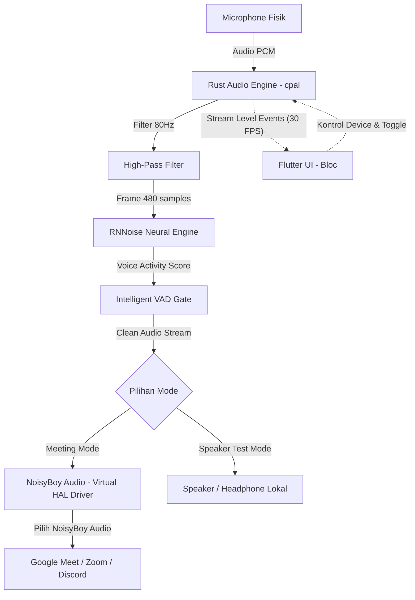

# 🎙️ NoisyBoy — Real-Time AI Noise Suppression for macOS

<p align="center">
  
</p>

<p align="center">
  <b>Aplikasi desktop macOS untuk menghilangkan kebisingan suara latar belakang (*background noise*) secara real-time menggunakan kecerdasan buatan (AI), mirip Krisp.ai.</b>
</p>

<p align="center">
  
  
  
  
</p>

---

## 📑 Daftar Isi

- [Fitur Utama](#-fitur-utama)
- [Cara Kerja & Arsitektur](#-cara-kerja--arsitektur)
- [Panduan Pengguna (Instalasi Instan)](#-panduan-pengguna-instalasi-instan)
- [Cara Menggunakan di Google Meet, Zoom, dan Discord](#-cara-menggunakan-di-google-meet-zoom-dan-discord)
- [Penggunaan Menu Bar & Background Mode](#-penggunaan-menu-bar--background-mode)
- [Panduan Pengembang (Build dari Source Code)](#-panduan-pengembang-build-dari-source-code)
- [Struktur Proyek](#-struktur-proyek)
- [Lisensi](#-lisensi)

---

## ✨ Fitur Utama

- 🧠 **AI Denoising Real-Time**: Menggunakan model *Deep Recurrent Neural Network* (RNNoise murni Rust) dengan latensi sangat rendah (< 15ms).
- 🔇 **Intelligent VAD Gate & Transient Suppression**: Memotong secara cerdas suara ketikan keyboard mekanikal, keresekan plastik/kertas, klik mouse, dan nafas saat tidak sedang berbicara.
- 🎛️ **High-Pass Filter 80Hz**: Menghilangkan getaran mekanikal meja dan getaran sub-bass sebelum diproses AI.
- 🔌 **Virtual Audio Driver Native macOS ("NoisyBoy Audio")**: Terpasang langsung di CoreAudio HAL macOS sehingga terdeteksi secara otomatis di semua aplikasi konferensi (Google Meet, Zoom, Discord, Slack, MS Teams, OBS, dll).
- 🍏 **macOS MenuBar Tray Integration**: Ikon di status bar untuk kontrol cepat (pilih mic, toggle AI, ubah mode) dan aplikasi tetap berjalan lancar saat window ditutup (*background running*).
- 📊 **Live Dual VU Meter**: Visualisasi sinyal suara *Input Microphone* vs *Clean Output* dengan animasi halo glow dinamis yang berpendar mengikuti volume suara.
- 🔄 **Dua Mode Operasi**:
  - **Meeting Mode**: Mengalirkan suara bersih langsung ke Virtual Mic (tanpa feedback ke speaker lokal).
  - **Speaker Test Mode**: Memutar suara bersih ke speaker/headphone untuk mendengar hasil filter secara lokal (*loopback*).

---

## 🏗️ Cara Kerja & Arsitektur



### Tech Stack
| Komponen | Teknologi | Deskripsi |
| :--- | :--- | :--- |
| **UI & State** | Flutter Desktop (macOS) + BLoC | Antarmuka dark glassmorphism modern, kontrol audio, visualizer. |
| **Bridge** | `flutter_rust_bridge` | Jembatan binding type-safe berkecepatan tinggi antara Flutter dan Rust. |
| **Audio I/O** | Rust (`cpal`, `ringbuf`) | Penangkapan dan pemutaran audio real-time tanpa jeda GC. |
| **AI Denoise** | Rust (`nnnoiseless`) + DSP C++ | Neural network RNNoise + High-Pass Filter + Smooth VAD Gating. |
| **Virtual Driver** | C (CoreAudio AudioServerPlugIn HAL) | Driver virtual audio macOS universal (`arm64` + `x86_64`). |

---

## 🚀 Panduan Pengguna (Instalasi Instan)

Jika Anda hanya ingin menggunakan aplikasi tanpa perlu compile dari source code:

### 1. Unduh Installer
Buka file installer yang tersedia di folder `dist/`:
- **`dist/NoisyBoy-Installer.dmg`** atau **`dist/NoisyBoy-Installer.pkg`**

### 2. Jalankan Installer
1. Buka file **`NoisyBoy-Installer.dmg`**.
2. Klik ganda pada **`NoisyBoy-Installer.pkg`** dan ikuti panduan wizard instalasi:
   - Installer akan memasang aplikasi ke `/Applications/NoisyBoy.app`.
   - Installer akan memasang virtual audio driver ke `/Library/Audio/Plug-Ins/HAL/NoisyBoyAudio.driver`.
   - Driver audio akan langsung diaktifkan secara otomatis.
3. Buka **NoisyBoy** dari Launchpad atau folder `/Applications`.

---

## 📞 Cara Menggunakan di Google Meet, Zoom, dan Discord

Setelah NoisyBoy terpasang, ikuti 3 langkah mudah berikut:

### Langkah 1: Buka & Nyalakan NoisyBoy
1. Buka aplikasi **NoisyBoy**.
2. Pastikan mode berada pada **Meeting Mode** (tab kiri).
3. Pilih **Input Microphone** fisik yang Anda gunakan (contoh: *MacBook Air Microphone* atau headset bluetooth Anda).
4. Pastikan toggle **AI Noise Suppression** dalam keadaan aktif (berwarna ungu).
5. Tekan tombol bulat besar di tengah hingga berstatus **ACTIVE**.

### Langkah 2: Atur Pengaturan Suara di Aplikasi Meeting

#### 🟢 Google Meet
1. Buka Google Meet $\rightarrow$ Klik icon **Settings** (roda gigi) $\rightarrow$ **Audio**.
2. Pada bagian **Microphone**, pilih **NoisyBoy Audio**.
3. Matikan fitur bawaan *"Noise cancellation"* di Google Meet agar suara tidak terproses ganda.

#### 🔵 Zoom
1. Buka Zoom $\rightarrow$ **Settings** $\rightarrow$ **Audio**.
2. Pada bagian **Microphone**, pilih **NoisyBoy Audio**.
3. (Opsional) Set *"Noise suppression"* di Zoom ke **Low / Auto**.

#### 🟣 Discord
1. Buka Discord $\rightarrow$ **User Settings** (icon gerigi) $\rightarrow$ **Voice & Video**.
2. Pada bagian **Input Device**, pilih **NoisyBoy Audio**.
3. Matikan *"Krisp / Noise Suppression"* bawaan Discord untuk efisiensi CPU maksimal.

---

## 🍏 Penggunaan Menu Bar & Background Mode

NoisyBoy dirancang agar tidak mengganggu aktivitas kerja Anda di Mac:

- **Tetap Aktif di Background**: Saat Anda menutup window utama menggunakan tombol merah **Close (X)**, aplikasi **tidak akan mati**. Suara meeting Anda akan tetap jernih dan disaring di background.
- **Ikon Status Bar**: Klik ikon mikrofon di menu bar atas macOS untuk:
  - Melihat status aktif NoisyBoy.
  - Membuka kembali window utama (*"Buka Window NoisyBoy"*).
  - Menyalakan/mematikan NoisyBoy secara instan.
  - Mengganti input mic atau output speaker tanpa membuka window.
- **Keluar Sepenuhnya**: Untuk menutup aplikasi total, pilih **"Keluar NoisyBoy (Quit)"** dari menu bar atau tekan `Cmd + Q`.

---

## 💻 Panduan Pengembang (Build dari Source Code)

### Prasyarat Sistem
- **macOS** 12.0 (Monterey) atau yang lebih baru.
- **Xcode** & Command Line Tools (`xcode-select --install`).
- **Flutter SDK** (versi 3.24+).
- **Rust Toolchain** & Cargo (`curl --proto '=https' --tlsv1.2 -sSf https://sh.rustup.rs | sh`).
- **flutter_rust_bridge_codegen** (`cargo install flutter_rust_bridge_codegen --version 2.12.0`).

### Langkah 1: Clone Repositori & Install Dependencies
```bash
# Clone repositori
git clone https://github.com/yudisetiawan/noisyboy.git
cd noisyboy

# Install Flutter packages
flutter pub get
```

### Langkah 2: Build & Install Virtual Audio Driver (Sekali Saja)
```bash
# Compile dan pasang driver ke /Library/Audio/Plug-Ins/HAL/
sudo bash driver/install_driver.sh
```

### Langkah 3: Jalankan dalam Mode Development
```bash
flutter run -d macos
```

### Langkah 4: Generate Binding Baru (Jika Mengubah Kode Rust)
```bash
flutter_rust_bridge_codegen generate
```

### Langkah 5: Membangun Installer DMG & PKG (.dmg / .pkg)
Untuk membuat paket installer release siap pakai:
```bash
./packaging/build_installer.sh
```
File installer hasil build akan tersedia di direktori `dist/`:
- `dist/NoisyBoy-Installer.pkg`
- `dist/NoisyBoy-Installer.dmg`

---

## 📂 Struktur Proyek

```
noisyboy/
├── assets/                  # Aset ikon dan logo (tray_icon.png)
├── driver/                  # Source code Driver Virtual Audio macOS
│   ├── NoisyBoyAudio.c      # CoreAudio AudioServerPlugIn HAL Driver (C)
│   ├── Info.plist           # Bundle metadata driver
│   ├── build_driver.sh      # Skrip build universal driver (arm64 + x86_64)
│   ├── install_driver.sh    # Skrip instalasi driver ke macOS HAL
│   └── uninstall_driver.sh  # Skrip uninstal driver
├── lib/                     # Flutter UI Layer
│   ├── bloc/                # BLoC State Management (LoopbackBloc)
│   ├── src/rust/            # Auto-generated Flutter-Rust bridge bindings
│   └── main.dart            # UI Utama, MenuBar Tray & Window Manager
├── macos/                   # Konfigurasi project macOS Flutter Runner
├── packaging/               # Toolchain Packaging macOS
│   ├── scripts/postinstall  # Skrip aktivasi otomatis CoreAudio saat install
│   └── build_installer.sh   # Skrip pembuat installer PKG & DMG universal
├── rust/                    # Core Audio & AI Denoising Engine (Rust)
│   ├── Cargo.toml           # Dependensi Rust (cpal, nnnoiseless, ringbuf)
│   └── src/api/audio.rs     # Pipeline audio, resampler, HighPassFilter, VAD Gate
├── dist/                    # Output installer (.dmg & .pkg)
├── PRD.md                   # Product Requirement Document
└── README.md                # Dokumentasi & Panduan Proyek
```

---

## 📄 Lisensi

Proyek ini dibangun untuk penggunaan pribadi dan didistribusikan di bawah lisensi open-source. Driver virtual CoreAudio berbasis pada arsitektur open-source Audio Server Plugin.
